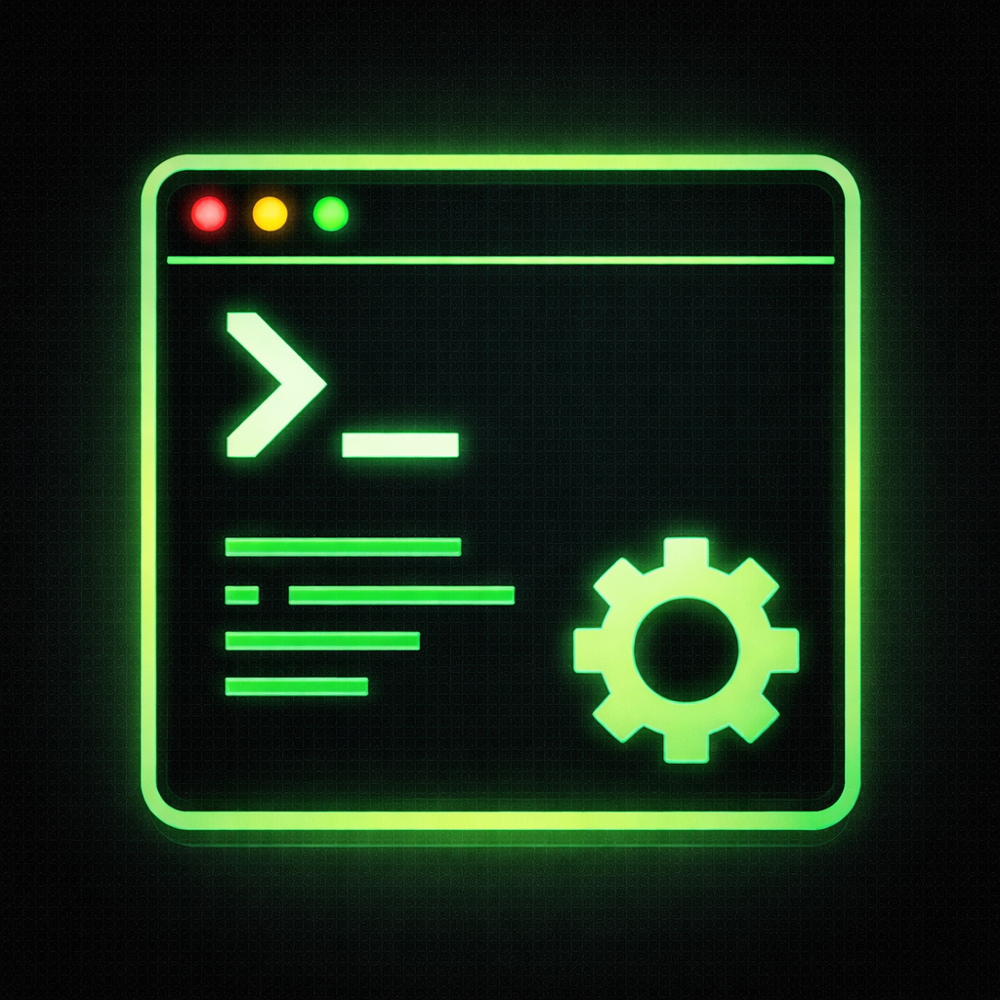

# Teamy Rust CLI

<!-- TODO(template): replace this README with project-specific documentation after copying the template. -->

[](https://crates.io/crates/teamy-rust-cli)
[](https://crates.io/crates/teamy-rust-cli)



Opinionated starting point for building small and medium Rust command line applications.

## What This Template Gives You

This template exists to remove the repeated setup work for a new CLI project. It ships with:

- `figue` + `facet` based argument parsing
- top-level output rendering with `text`, `json`, and `csv` formats
- `--help` and `--version` support, including git revision and local-time build timestamp in version output
- structured logging to stderr with optional NDJSON log files
- Windows app resources wired through `build.rs`
- CLI roundtrip fuzz tests
- PowerShell helpers for initializing a new repository and running the full quality gate

## Quick Start

Copy the template into another repository:

```powershell
./init-other-repo.ps1 ../my-new-cli
```

Then update the obvious placeholders in the destination repository:

- package metadata in `Cargo.toml`
- environment variable names in `src/paths/mod.rs`
- repository URL in `src/lib.rs`
- README text and examples

## Example Usage

Inspect the generated CLI surface:

```powershell
cargo run -- --help
```

Show the resolved application home directory:

```powershell
cargo run -- home show
```

Render the same command as JSON:

```powershell
cargo run -- --output-format json home show
```

Show the resolved cache directory:

```powershell
cargo run -- cache show
```

Write structured logs to disk while still logging to stderr:

```powershell
cargo run -- --log-file .\logs home show
```

## Command Output

Commands that return structured data render through a shared top-level output layer.

- Use `--output-format text`, `--output-format json`, or `--output-format csv` to choose the format explicitly.
- If `--output-format` is omitted, the CLI defaults to `text` in an interactive terminal and `json` when stdout is redirected.
- Commands that only perform side effects, such as `open` and `clean`, return no structured stdout payload.

## Environment Variables

<!-- TODO(template): replace the environment variable names below with project-specific names. -->

The template currently recognizes these environment variables:

- `APP_HOME_DIR`: overrides the resolved application home directory
- `APP_CACHE_DIR`: overrides the platform-derived cache directory
- `RUST_LOG`: provides a tracing filter when `--log-filter` is not supplied

These names are placeholders and should be renamed in the generated project.

## Quality Gate

Run the standard validation flow with:

```powershell
./check-all.ps1
```

That script runs formatting, linting, build, and tests

For Tracy profiling, run:

```powershell
./run-profiler.ps1 home show
```

<!-- TODO(template): update the example profiling command above to match the generated project's command surface. -->

## Repository Layout

```text
. # Some files omitted
├── build.rs # Adds exe resources and embeds git revision/build timestamp
├── Cargo.toml # Package metadata, dependencies, lint policy
├── check-all.ps1 # Formatting, linting, build, tests
├── resources # Windows resources used by build.rs
├── src # Rust source code
├── tests # CLI roundtrip fuzz tests
└── update.ps1 # Convenience install helper
```
